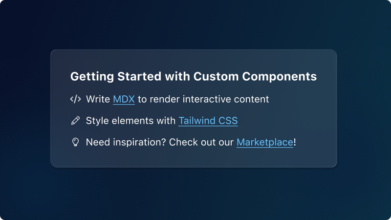

# ExampleComponent

## Overview

This is the default `<ExampleComponent />` that we pre-fill when you create a new component in ReadMe! You can use this is a starter template for your own component.

Upload a screenshot of the component using the format `component-name.png` and dimensions of 800x450 pixels (16:9).


## Usage

```mdx
<ExampleComponent header="Getting started with Custom Components" />
```

## Props

| Prop           | Type   | Description                                 |
| -------------- | ------ | --------------------------------------------|
| `header`       | string | The title displayed at the top.             |
