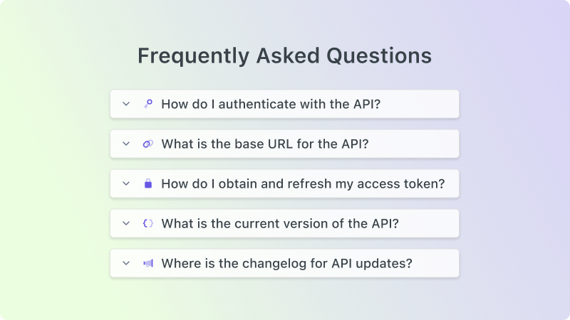

# Accordion

## Overview

An accordion can be used to expand and collapse sections of content. You can add this customizable component to your docs to organize and display large amounts of information in a compact and interactive way.



## Usage

```mdx
<Accordion title="My Accordion Title" icon="fa-info-circle" iconColor="purple">
  Lorem ipsum dolor sit amet, **consectetur adipiscing elit.** Ut enim
  ad minim veniam, quis nostrud exercitation ullamco. Excepteur sint
  occaecat cupidatat non proident!
</Accordion>
```

## Props

| Prop           | Type   | Description                                      |
| -------------- | ------ | -------------------------------------------------|
| `icon`         | string | A Font Awesome icon displayed next to the title. |
| `iconColor`    | string | The color of the icon.                           |
| `title`        | string | The heading label for the accordion.             |