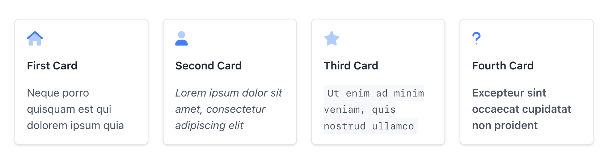

# Cards

## Overview

Cards can be used to display content in an organized grid layout. Each card can contain a title, icon, and descriptive text, and optionally link to another page. It's useful for showcasing features, links, or grouped information in a visually structured way.



## Usage

```mdx
<Cards columns={4}>
  <Card title="First Card" href="https://readme.com" icon="fa-home" target="_blank">
    Neque porro quisquam est qui dolorem ipsum quia
  </Card>
  <Card title="Second Card" icon="fa-user">
    *Lorem ipsum dolor sit amet, consectetur adipiscing elit*
  </Card>
  <Card title="Third Card" icon="fa-star">
    `Ut enim ad minim veniam, quis nostrud ullamco`
  </Card>
  <Card title="Fourth Card" icon="fa-question">
    **Excepteur sint occaecat cupidatat non proident**
  </Card>
</Cards>
```

## Props

### `Cards`
| Prop           | Type   | Description                                           |
| -------------- | ------ | ------------------------------------------------------|
| `columns`      | number | The amount of cards displayed in a row, default `2`.  |

### `Card`
| Prop           | Type   | Description                                           |
| -------------- | ------ | ------------------------------------------------------|
| `title`        | string | The heading for the card.                             |
| `icon`         | string | A Font Awesome icon displayed at the top of the card. | 
| `iconColor`    | string | The color of the icon.                                |
| `href`         | string | The URL that opens on card click.                     |      
| `target`       | string | Where to display the linked URL, default `_self`.     |

