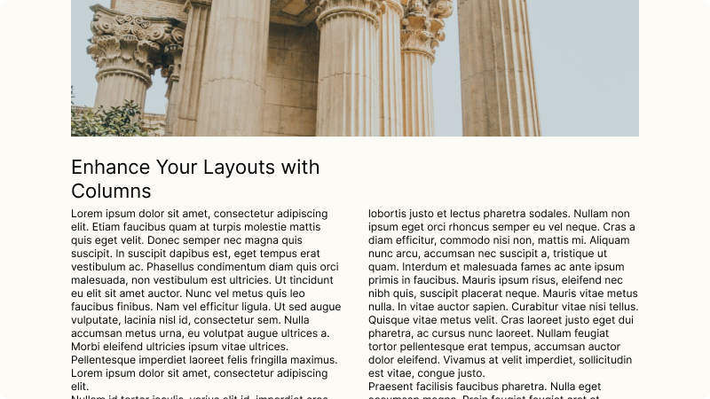

# `<Columns/>`

## Overview

Arrange content side-by-side in a responsive grid layout. Create multi-column sections that support both fixed-width and auto-sizing layouts in your docs. 



## Usage

```mdx
<Columns layout="fixed">
  <Column>
    Neque porro quisquam est qui dolorem ipsum quia
  </Column>
  <Column>
    *Lorem ipsum dolor sit amet, consectetur adipiscing elit*
  </Column>
  <Column>
    **Ut enim ad minim veniam, quis nostrud ullamco**
  </Column>
</Columns>
```

## Props

### `Columns`
| Prop           | Type   | Description                                        |
| -------------- | ------ | ---------------------------------------------------|
| `layout`       | string | `fixed` sets the columns as equal widths, `auto` shrinks/grows based on content. |
