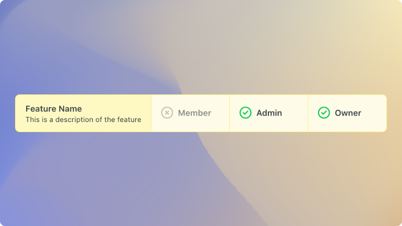

# `<Compatibility />`

## Overview

Show compatibility across features, plans, or anything you need!



## Usage

You can use it to show features:

```jsx
<Compatibility
  title="Feature Name"
  subtitle="This is a description of the feature"
  plans={{ Free: false, Business: true, Enterprise: true }}
/>
```

Or user roles:

```jsx
<Compatibility
  title="Feature Name"
  subtitle="This is a description of the feature"
  plans={{ Member: false, Admin: true, 'Super Admin': true }}
/>
```
