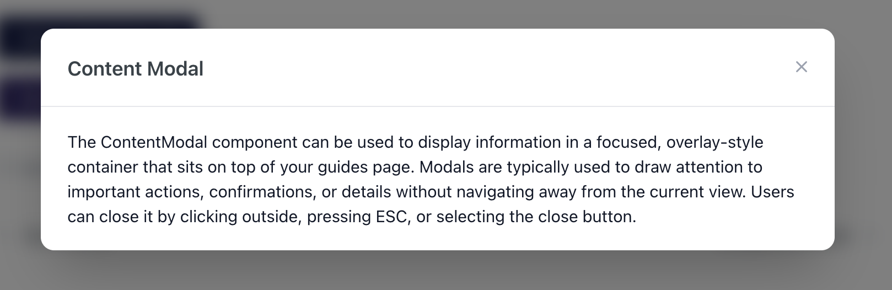

# `<ContentModal/>`

## Overview

A lightweight, theme-aware modal component for displaying custom content in an overlay-style container that sits on top of your guides page. Perfect for showcasing additional information, confirmations, or details without navigating away from the current view.



## Usage

```mdx
<ContentModal
  label="Open Content Modal"
  title="Content Modal"
  size="md"
  buttonColor="#0B1440"
  content="
    The ContentModal component can be used to display information in a focused, overlay-style container that sits on top of your guides page. 
Modals are typically used to draw attention to important actions, confirmations, or details without navigating away from the current view. 
Users can close it by clicking outside, pressing ESC, or selecting the close button.
  "
/>
```

## Props

| Prop          | Type   | Description                                                                                       |
| ------------- | ------ | ------------------------------------------------------------------------------------------------- |
| `label`       | string | The text displayed on the trigger button.                                                         |
| `title`       | string | The title displayed at the top of the modal.                                                      |
| `content`     | string | The content to display inside the modal body.                                                     |
| `size`        | string | Modal width: `'sm'` (480px), `'md'` (720px), `'lg'` (960px), `'xl'` (1200px). Defaults to `'md'`. |
| `buttonColor` | string | Hex color code for the button background. Defaults to `'#0B1440'`.                                |
