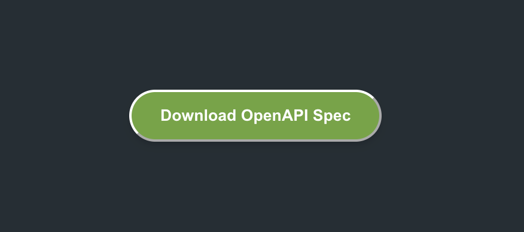

# `<DownloadOasButton/>`

Overview

Add an OpenAPI Download Button to your documentation, allowing users to download your OpenAPI JSON file with one click.



Usage

```mdx
<DownloadOasButton url="https://your-domain.com/openapi/openapi.json" />
```

### How to Find Your OpenAPI URL

1. Go to your ReadMe project
2. In edit mode, navigate to the "API Reference" section and open the "API Definitions" tab
3. Find the desired definition, click the dropdown next to it, and select "View OAS File"
4. Copy the URL that appears and add it to the component

#### Make sure your definition is publicly accessible:

- Go to Settings → General
- In the "OpenAPI Access" section, set "View Permissions" to "Public"

### Props

- `url` (required): The URL to your OpenAPI JSON file
