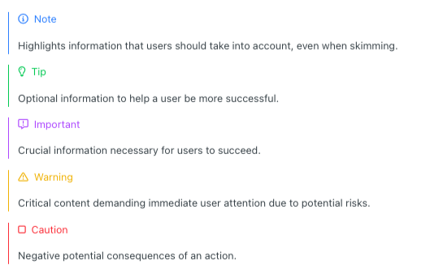
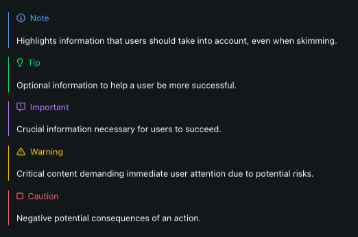

# `<GitHubCallout />`

## Overview

This component mimics the undocumented way that GitHub renders callouts. https://github.com/orgs/community/discussions/16925



It also supports dark mode:



## Usage

It supports five different types of callouts: `note`, `tip`, `important`, `warning`, and `caution`.

```jsx
<GitHubCallout type="note">
  This is a note!
</GitHubCallout>
```
