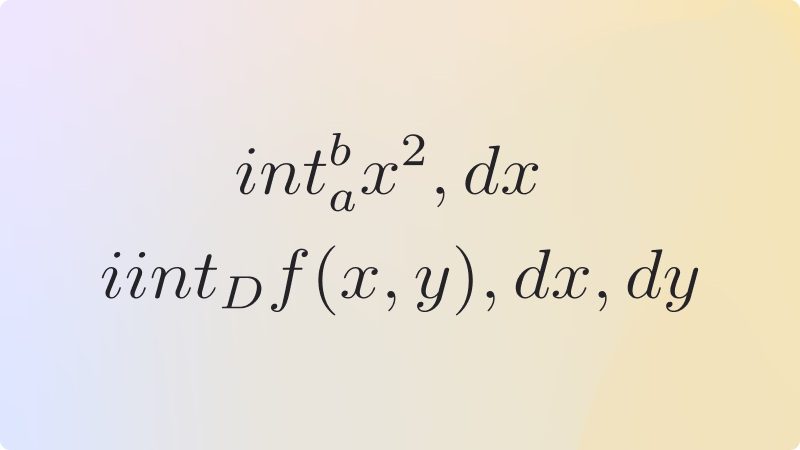

# `<Latex/>`

## Overview

Render LaTeX syntax. (**Note**: this will fetch the `react-latex-next` package from a CDN on page load.)



## Usage

```mdx
<Latex>{`
  We give illustrations for the ${1 + 2} processes $e^+e^-$, gluon-gluon and
  $\\gamma\\gamma \\to W t\\bar b$.
`}</Latex>
```
