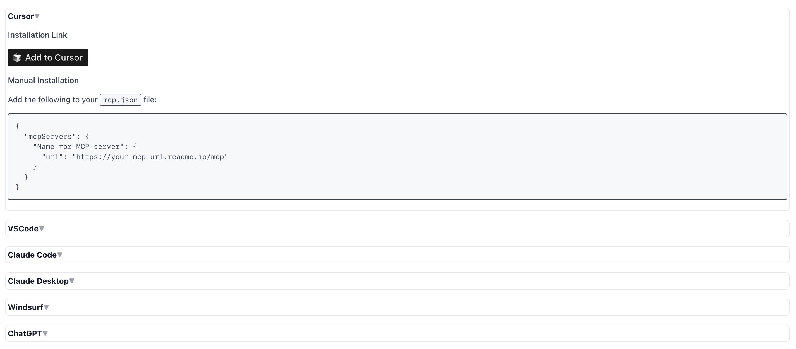

# `<MCPInstructions />`

## Overview

Display instructions for using an MCP server across various MCP clients.



## Usage

```mdx
<MCPInstructions name="Name for MCP server" url="https://your-mcp-url.readme.io/mcp">
```

## Props

| Prop   | Type   | Description                 |
| ------ | ------ | --------------------------- |
| `name` | string | The name of the MCP server. |
| `url`  | string | The URL of the MCP server.  |
