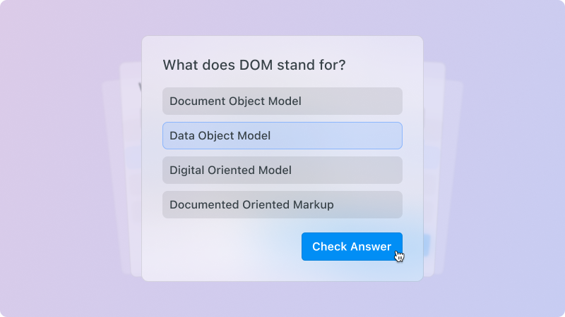

# `<QuizGame/>`

## Overview

Display a question with multiple-choice answers, let the user select an option, and check if the answer is correct.



## Usage

```mdx
<QuizGame
  question="What does DOM stand for?"
  options={[
    { text: 'Document Object Model', isCorrect: true },
    { text: 'Data Object Model', isCorrect: false },
    { text: 'Digital Oriented Model', isCorrect: false },
    { text: 'Document Oriented Markup', isCorrect: false },
  ]}
/>
```

## Props

| Prop       | Type   | Description                                                                               |
| ---------- | ------ | ----------------------------------------------------------------------------------------- |
| `question` | string | The question displayed at the top of the quiz.                                            |
| `options`  | array  | An array of answer options. Each object must have `{ text: string, isCorrect: boolean }`. |
