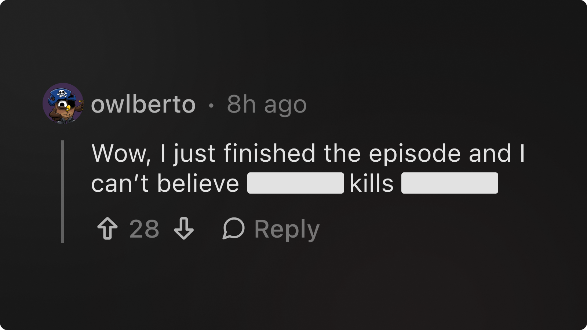

# `<Spoiler/>`

## Overview

Conceal content behind a clickable overlay—perfect for hiding spoilers or sensitive information.



## Usage

```mdx
<Spoiler>Click to reveal the spoiler!</Spoiler>
```

### Customization

Customize the appearance and animation:

```mdx
<Spoiler overlayColor="gray" fadeDuration={1000}>
  Spoiler text with custom settings.
</Spoiler>
```

### Props

| Prop           | Type   | Default   | Description                                |
| -------------- | ------ | --------- | ------------------------------------------ |
| `overlayColor` | string | `'black'` | Color of the overlay covering the content. |
| `fadeDuration` | number | `500`     | Duration of fade-out effect (ms).          |
