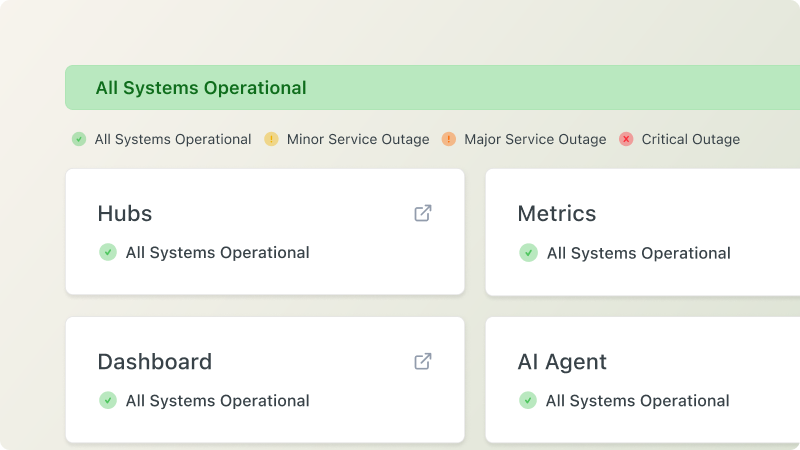

# `<StatusPage/>`

## Overview

Embed the current operational status, health, or uptime of a service or system by fetching the live status information from a public [Statuspage](https://www.atlassian.com/software/statuspage) endpoint (e.g. https://www.githubstatus.com). It displays the status indicator and description.



## Usage

```mdx
<StatusPage title="ReadMe Status" url="https://www.readmestatus.com" />
```

## Props

| Prop    | Type   | Description                       |
| ------- | ------ | --------------------------------- |
| `title` | string | The heading displayed at the top. |
| `url`   | string | The URL of the status page.       |
