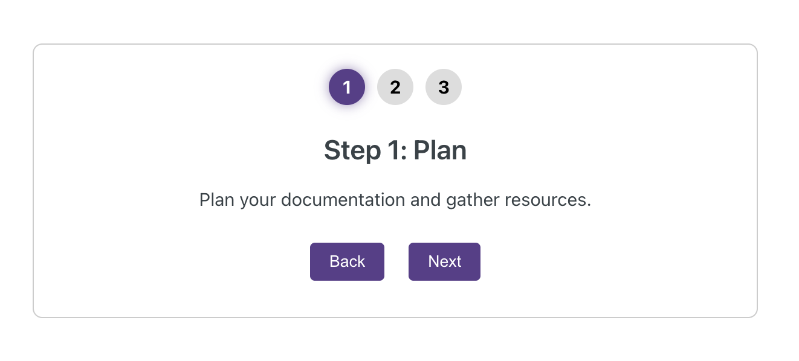

# 🪜 Simple Stepper

Provides basic "Next" and "Back" navigation for stepping through content.



## ✨ Features

- ✅ **ADA Compliant** – High-contrast colors, keyboard navigation, and screen reader support.
- 🎨 **Customizable** – Easily update colors and styles.
- ⚡ **Lightweight & Fast** – No dependencies, just React hooks.

---

## 📦 Usage

```mdx
<SimpleStepper>
  <SimpleStep header="Step 1: Plan">
    Plan your documentation and gather resources.
  </SimpleStep>
  <SimpleStep header="Step 2: Write">
    Write effective and clear documentation.
  </SimpleStep>
  <SimpleStep header="Step 3: Review">
    Review and refine your content.
  </SimpleStep>
</SimpleStepper>
```