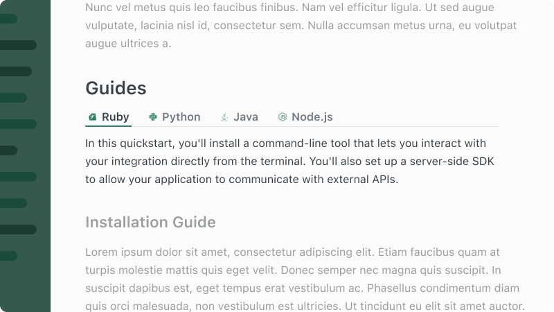

# Tabs

## Overview

Tabs can be used to organize content into sections where only one is visible at a time, letting you switch between them for a cleaner and more interactive reading experience.



## Usage

```mdx
<Tabs>
  <Tab title="First Tab" icon="fa-clock" iconColor="blue-500">
    Welcome to the content that you can only see inside the first Tab.
  </Tab>
  <Tab title="Second Tab" icon="fa-star" iconColor="blue-500">
    This is content that you can only see inside the second Tab.
  </Tab>
  <Tab title="Third Tab" icon="fa-heart" iconColor="blue-500">
    This is content that you can only see inside the third Tab.
  </Tab>
</Tabs>
```

## Props

### `Tab`
| Prop           | Type   | Description                                      |
| -------------- | ------ | -------------------------------------------------|
| `icon`         | string | A Font Awesome icon displayed next to the title. |
| `iconColor`    | string | The color of the icon.                           |
| `title`        | string | The label for the tab.                           |