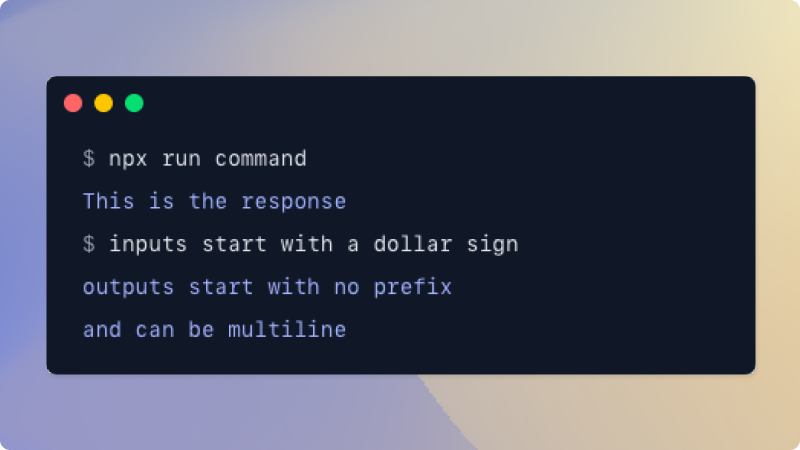

# `<Terminal>`

## Overview

This component makes it easy to include a nice-looking faux Terminal window in your docs, to show input and output from a CLI. The input lines also have a copy button, to make it easy to run the commands yourself.



## Usage

Pass in a string. Starting a line with a `$` means it's an input line, and starting it with anything else means it's an output line.

```jsx
<Terminal>{`
  $ npx run this is the input
  This is the response

  $ inputs start with a dollar sign
  outputs start with nothing
  and can be multiline
`}</Terminal>
```
