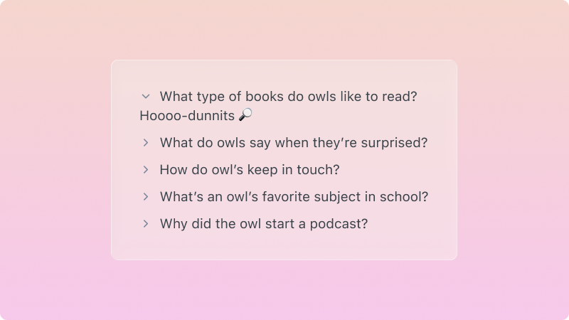

# `<ToggleList/>`

## Overview

Create a list of items that expand and collapse. Useful for gradually introducing content. For example maybe you want to tuck away details that might overwhelm the reader if displayed all at once, or maybe you want to hide the punchline of a joke!



## Usage

There are two components that get used together, `ToggleList` and `ToggleListItem`:

- `ToggleList` is the wrapper around all of your list items and can optionally accept any of the same props as a `ul` element.
- `ToggleListItem` is a single item in the list, that accepts a `title` to display next to the toggle button and `children` that are shown or hidden based on the toggled state. It also can optionally accept any of the same props as a `li` element.

```jsx
<ToggleList>
  <ToggleListItem title="What type of books do owls like to read?">Hoooo-dunnits 🔎</ToggleListItem>
  <ToggleListItem title="What’s an owl’s favorite drink?">Hoot beer 🥤</ToggleListItem>
</ToggleList>
```
