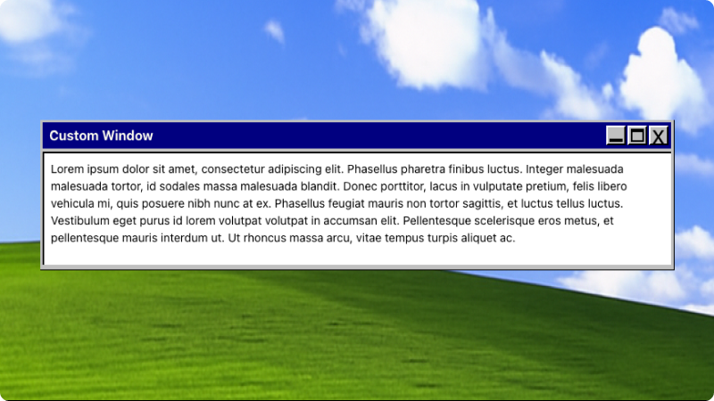

# `<Windows/>`

## Overview

Bring a retro Windows vibe to your docs.



## Usage

```jsx
<Windows header="Custom Window">
  <p>Lorem ipsum dolor sit amet, consectetur adipiscing elit. Phasellus pharetra finibus luctus. Integer malesuada malesuada tortor, id sodales massa malesuada blandit. Donec porttitor, lacus in vulputate pretium, felis libero vehicula mi, quis posuere nibh nunc at ex. Phasellus feugiat mauris non tortor sagittis, et luctus tellus luctus. Vestibulum eget purus id lorem volutpat volutpat in accumsan elit. Pellentesque scelerisque eros metus, et pellentesque mauris interdum ut. Ut rhoncus massa arcu, vitae tempus turpis aliquet ac.</p>
</Windows>
```
